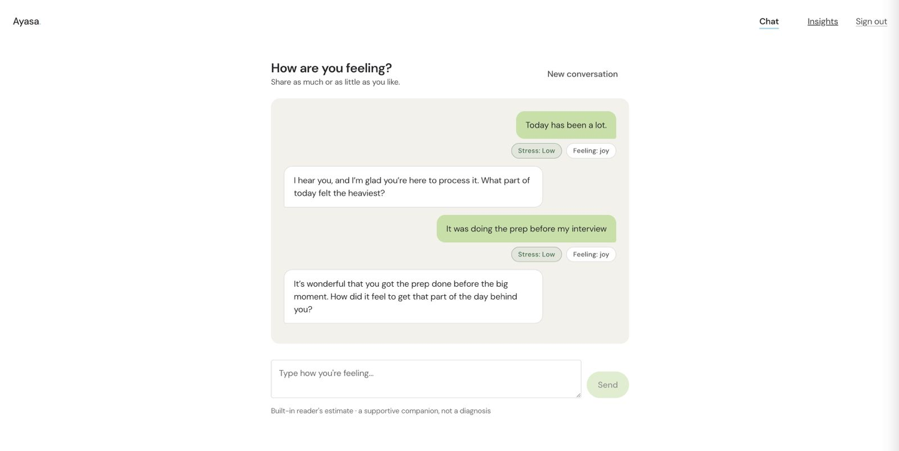
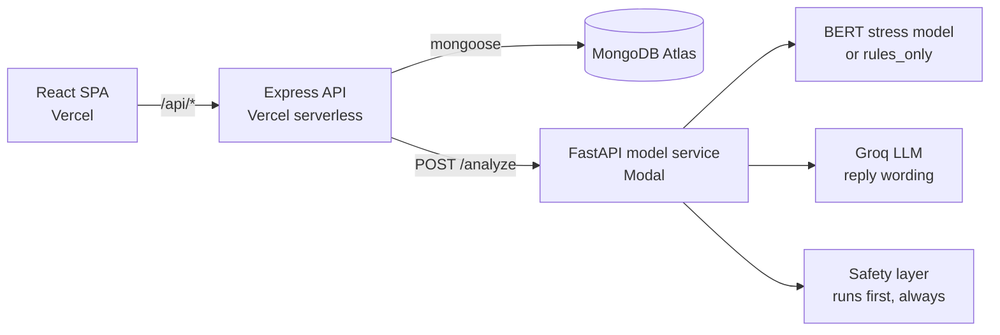
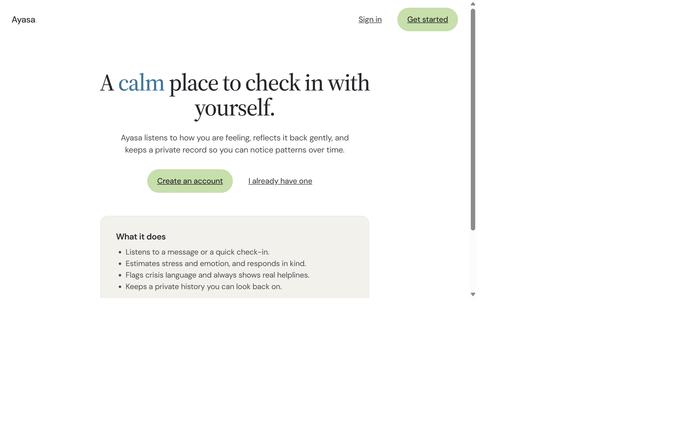
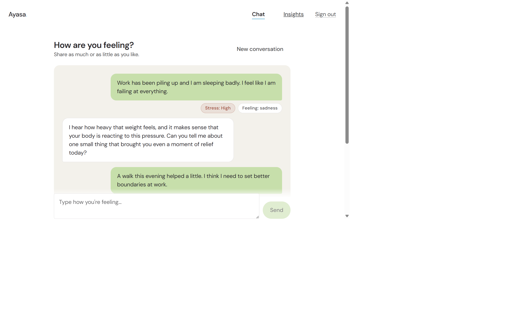

# Ayasa

Ayasa is a mental-wellbeing check-in app. A user talks to a chat assistant or
logs a short check-in; Ayasa estimates their stress level and dominant emotion,
responds with a supportive reply, and shows patterns over time on a personal
insights page. The core engineering problem is trust: every estimate is
labeled as an estimate, crisis text is caught by a deterministic safety layer
that never depends on a model or the network, and each service in the stack
owns exactly one responsibility.



## Live Demo

- App: <https://ayasa-client.vercel.app>
- API: <https://ayasa-server.vercel.app> (health: `/api/health`)

## Overview

Three services, one job each:

- **Client** — React 18 SPA. Talks only to the API; never touches the database.
- **Server** — Express API. Auth, sessions, check-ins, persistence. The only
  service that reads or writes MongoDB.
- **Model service** — FastAPI. Text in, structured analysis out. Knows nothing
  about users or the database, so it can run locally, in a container, or on a
  GPU platform without the server caring.

The server and model service agree on a versioned response contract
(`contract.js` / `contract.py`, currently **1.1.0**): one shared vocabulary
(`Low` / `Medium` / `High`), one `/analyze` endpoint, and a self-reported
`model_mode` so the UI can honestly say which engine produced a result.

## Features

- Account auth with JWT and bcrypt-hashed passwords; protected routes end to end.
- Chat sessions with per-message stress and emotion analysis shown as pills.
- Quick check-ins stored with level, emotion, confidence, and model mode.
- Insights page: aggregate stress counts and recent check-in history per user.
- Crisis safety layer runs on raw text **before** any model or LLM call;
  matched text returns a fixed helpline response (Tele-MANAS `14416`), never
  a generated one.
- Two analysis modes behind one interface: a deterministic `rules_only`
  engine (zero ML dependencies, boots instantly) and a fine-tuned BERT
  transformer (`ganeshtk/silentstress-model`) for emotion and stress
  classification.
- Optional reply-wording layer via Groq (Llama 3.1), with deterministic
  fallback replies when it is not configured.
- Versioned API contract between server and model service.

## Architecture



| Layer | What runs where |
| --- | --- |
| Frontend | Vite build served by Vercel (`client/`) |
| Backend / API | Express on Vercel serverless, entry `server/api/index.js` |
| ML service | FastAPI on Modal (`model-service/modal_app.py`) |
| Database | MongoDB Atlas |
| Auth | JWT signed by the server, verified by `server/middleware/auth.js` |

Safety is duplicated on purpose: `model-service/safety.py` and
`server/utils/safety.js` both detect crisis text, so the server's own
fallback still returns the helpline even if the model service is unreachable.

> Ayasa is a student project and a software-engineering demo, not a medical
> device. It does not diagnose anything.

## Tech Stack

| Area | Used |
| --- | --- |
| Frontend | React 18, Vite 5, React Router 6 |
| Backend | Node.js, Express 4, Mongoose 8, JWT, bcryptjs |
| ML service | Python, FastAPI, PyTorch, Transformers (BERT) |
| LLM replies | Groq API (Llama 3.1), optional |
| Database | MongoDB Atlas |
| Deployment | Vercel (client + server), Modal (ML service), Docker Compose (local) |
| Testing | `node --test` (server), pytest (model service) |

## Project Structure

```
ayasa/
├── client/                 # React 18 + Vite SPA
│   └── src/
│       ├── api.js          # single fetch helper
│       ├── auth.jsx        # auth context
│       ├── pages/          # Landing, Login, Register, Chat, Insights
│       └── components/     # Layout, RequireAuth, StressPill
├── server/                 # Express API
│   ├── api/index.js        # Vercel serverless entrypoint
│   ├── config/db.js        # the one DB connection
│   ├── contract.js         # mirrors contract.py
│   ├── middleware/auth.js  # JWT verification
│   ├── models/             # User, Session, Message, CheckIn
│   ├── controllers/        # auth, sessions, check-ins
│   ├── routes/             # /api/auth, /api/sessions, /api/checkins
│   ├── utils/              # safety.js, modelClient.js, http.js
│   └── tests/
├── model-service/          # FastAPI ML boundary
│   ├── contract.py         # single source of truth for the vocabulary
│   ├── safety.py           # crisis detection (runs first)
│   ├── schemas.py          # request/response contract
│   ├── model.py            # transformer OR rules_only, same output
│   ├── llm.py              # Groq reply layer
│   ├── main.py             # /health, /version, /analyze
│   ├── modal_app.py        # Modal deployment definition
│   └── tests/
├── docs/screenshots/
└── docker-compose.yml      # local stack: mongo + model + server + client
```

## Running Locally

### Option A — Docker (one command)

```bash
docker compose up --build
```

Open <http://localhost:5173>. The transformer model is off by default so the
stack boots fast and deterministically. To load it, set `ENABLE_HF_MODELS=true`
(and `HF_TOKEN` only if the model repo is private) in your environment before
running compose.

### Option B — three terminals

```bash
# 1. Database (or point MONGODB_URI at your own Atlas cluster)
docker run -d --name ayasa-mongo -p 27017:27017 mongo:7

# 2. Model service
cd model-service
python -m venv .venv
.venv/bin/pip install -r requirements.txt
ENABLE_HF_MODELS=false .venv/bin/python -m uvicorn main:app --port 8000

# 3. API server
cd server
npm install
cp .env.example .env   # then fill in MONGODB_URI, JWT_SECRET, MODEL_SERVICE_URL
npm run dev

# 4. Client
cd client
npm install
npm run dev            # dev server proxies /api to http://localhost:5000
```

Environment variables (see each service's `.env.example`):

| Service | Variables |
| --- | --- |
| server | `PORT`, `MONGODB_URI`, `JWT_SECRET`, `MODEL_SERVICE_URL`, `MODEL_TIMEOUT_MS`, `CLIENT_ORIGIN`, `GROQ_API_KEY` (optional) |
| model-service | `ENABLE_HF_MODELS`, `STRESS_MODEL_NAME`, `STRESS_MODEL_SUBFOLDER`, `HF_TOKEN` (optional), `GROQ_API_KEY` (optional), `GROQ_MODEL` |
| client | `VITE_API_URL` (empty in dev; set to the deployed API URL in production) |

### Tests

```bash
cd server        && npm test                        # 12 tests
cd model-service && .venv/bin/python -m pytest -q   # 23 tests
cd client        && npm run build                   # build check
```

## API

| Method | Path | Purpose |
| --- | --- | --- |
| `POST` | `/api/auth/register` | Create account |
| `POST` | `/api/auth/login` | Get JWT |
| `GET` | `/api/auth/me` | Current user |
| `GET` / `POST` | `/api/sessions` | List / create chat sessions |
| `GET` / `POST` | `/api/sessions/:id/messages` | Read / append messages |
| `GET` / `POST` | `/api/checkins` | List / create check-ins |
| `GET` | `/api/checkins/insights` | Aggregate stress counts + recent entries |
| `GET` | `/api/health` | API and model-service reachability |

The model service exposes `GET /health`, `GET /version`, and `POST /analyze`.
`/analyze` returns the versioned analysis object (`stress_level`, `confidence`,
`dominant_emotion`, `strategy`, `reply`, `model_mode`, `is_safety_override`).

## Screenshots

| Landing page | A real check-in: stress and emotion pills, honest "estimate" footer |
| --- | --- |
|  |  |
