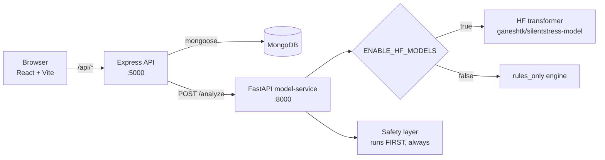

# Ayasa

A calm, reliable mental-wellbeing check-in app. Talk in a chat or log a quick
check-in; Ayasa estimates your stress level, responds, and shows you patterns
over time.

This is a **from-scratch rebuild** of an earlier prototype. The old version was
ambitious and buggy. This one is deliberately small and boring in the places
that matter, because a mental-health product has to be *trustworthy* before it
is clever.

---

## Why it was rebuilt

The original had a few real defects. Each one is fixed here on purpose, and
each fix is a lesson:

| Original problem | Why it broke | What this version does |
| --- | --- | --- |
| Database rejected model output | Model emitted `"Medium"`, DB enum only allowed `"Moderate"` | One shared vocabulary (`Low`/`Medium`/`High`) defined in `contract.py` and `contract.js`, used by every layer |
| Two endpoints (`/predict` + `/chat`) drifted apart | Two contracts, two sources of truth | A single `POST /analyze` endpoint, versioned `1.0.0` |
| App crashed / misbehaved when the ML model was missing | Model was treated as always-present | `rules_only` is a **first-class mode** — the service boots and works with zero ML installed |
| Silent failures from the LLM step | Exceptions swallowed, responses guessed | Deterministic replies + safety run **first**, no network needed |
| Heavy WebGL orb that sometimes failed to render | `ogl` shader, GPU-dependent | A lightweight pure-CSS "breathing" orb |
| Duplicate DB connection files | Copy-paste drift | One `config/db.js` |

### The headline bug (fixed)

```
model output:  "Medium"
CheckIn enum:  ["Low", "Moderate", "High"]   ← "Medium" not allowed
result:        ValidationError on save
```

Valid predictions were being thrown away. Now every layer speaks the same
vocabulary, and there is a test named
`test_moderate_becomes_medium_not_a_crash` guarding the exact collision.

---

## Architecture



Three services, one job each:

- **`client/`** — React 18 + Vite. Talks only to the API.
- **`server/`** — Express + Mongoose. Auth, chat, check-ins, persistence. It is
  the **only** thing that touches the database.
- **`model-service/`** — FastAPI. Text in, structured analysis out. It knows
  nothing about users or the database.

The server talks to the model-service by URL. The model-service could be a
remote API, a GPU box, or a local process — the server doesn't care.

---

## The contract (the most important idea in this repo)

Every layer agrees on one shape:

```json
{
  "contract_version": "1.0.0",
  "model_mode": "rules_only",
  "is_safety_override": false,
  "stress_level": "Medium",
  "confidence": 0.62,
  "dominant_emotion": "sadness",
  "strategy": "empathetic_probe",
  "reply": "Thank you for sharing that honestly...",
  "emotions": { "joy": 0.05, "sadness": 0.4, "...": 0.2 }
}
```

`contract_version` is not decoration. When you change the shape, bump it — old
clients can then detect the change instead of silently misreading fields.

`model_mode` is self-describing. The UI can honestly say "using the fallback
engine" instead of pretending everything is the neural model.

`strategy` decouples *what the model found* from *what the product does*:

| strategy | when | product behavior |
| --- | --- | --- |
| `crisis_override` | safety layer matched | show helpline, never improvise |
| `deep_support` | High stress | validate, ask what's heaviest |
| `calm_validation` | Medium + anger | acknowledge the frustration |
| `empathetic_probe` | Medium | gentle open question |
| `light_checkin` | Low | light, forward-looking |

---

## Safety is layered and runs first

Safety is the one thing that must never depend on a model, an LLM, or the
network. So it runs on **raw text, before anything else**, in two places:

- `model-service/safety.py`
- `server/utils/safety.js`

Yes, that is deliberate duplication. If the model-service is down, the server's
own fallback still detects crisis text and returns the helpline. Safety is not
allowed to have a single point of failure.

When crisis is detected:

- `is_safety_override` becomes `true`
- `stress_level` is forced to `High`
- the reply is a **constant** (`CRISIS_RESPONSE`) pointing to Tele-MANAS
  `14416` / `1-800-891-4416`

It is never generated, so it can never drift or hallucinate.

> ⚠️ This is a student project and a demo of engineering, **not** a medical
> device. It does not diagnose anything.

---

## Run it

### Option A — Docker (one command)

```bash
docker compose up --build
```

Then open <http://localhost:5173>.

The HF model is **off by default** so it starts fast. To load it:

```bash
ENABLE_HF_MODELS=true HF_TOKEN=hf_xxx docker compose up --build
```

> If `5000` or `8000` are already used on your machine (macOS AirPlay often
> takes 5000), change the left-hand side of the port mappings in
> `docker-compose.yml`, e.g. `"5050:5000"`.

### Option B — local, three terminals

Use Python **3.12** (3.13+ has no PyTorch wheels for older Macs).

```bash
# 1. Database
docker run -d --name ayasa-mongo -p 27017:27017 mongo:7

# 2. Model service
cd model-service
/usr/local/bin/python3.12 -m venv .venv
.venv/bin/pip install -r requirements.txt
ENABLE_HF_MODELS=false .venv/bin/python -m uvicorn main:app --port 8000

# 3. API server
cd server
npm install
MONGODB_URI="mongodb://127.0.0.1:27017/ayasa" \
MODEL_SERVICE_URL="http://127.0.0.1:8000" \
JWT_SECRET="dev-secret" \
npm run dev

# 4. Client
cd client
npm install
npm run dev
```

To use your actual model, add the ML dependencies and flip the flag:

```bash
.venv/bin/pip install -r requirements-ml.txt
ENABLE_HF_MODELS=true STRESS_MODEL_NAME=ganeshtk/silentstress-model \
  .venv/bin/python -m uvicorn main:app --port 8000
```

---

## Tests

```bash
cd model-service && .venv/bin/python -m pytest -q   # 23 tests
cd server        && npm test                        # 12 tests
cd client        && npm run build                   # build check
```

The tests deliberately lock in the two things that used to be wrong:

- `test_moderate_becomes_medium_not_a_crash` — the vocabulary collision
- `test_mild_hedged_worry_is_not_high` — calibration (see below)

---

## Calibration: why the fallback still matters

Even without the neural model, the rules engine tries to be *reasonable*:

```
Low    0.85   "Calm day, slept well and studied."
Medium 0.48   "A bit overwhelmed with exams but I am managing."
Medium 0.67   "Exams are stressing me out and I cannot sleep."
High   0.67   "I feel completely hopeless."
High   0.81   "I am so exhausted and lonely, I have been crying all week."
```

Two design choices make this work:

1. **Cue severity** — "hopeless" (severe) is stronger than "overwhelmed"
   (moderate). One moderate word should not max out the alarm.
2. **Softening** — hedges ("a bit") and recovery clauses ("but I am managing")
   *multiply* the pressure down, floored at `0.35`. That floor matters: never
   fully erase a concern the person actually named. False alarms are how a
   wellbeing app loses trust.

---

## Project layout

```
ayasa/
├── docker-compose.yml
├── model-service/          # Python, the model boundary
│   ├── contract.py         # single source of truth for the vocabulary
│   ├── safety.py           # crisis detection (runs first)
│   ├── schemas.py          # the request/response contract
│   ├── model.py            # transformer OR rules_only, same output
│   └── main.py             # FastAPI: /health, /version, /analyze
├── server/                 # Node, the product boundary
│   ├── contract.js         # mirrors contract.py
│   ├── utils/safety.js     # mirrors safety.py (on purpose)
│   ├── utils/modelClient.js# resilient client, never throws
│   ├── models/             # User, Session, Message, CheckIn
│   └── controllers/        # auth, sessions, check-ins
└── client/                 # React
    ├── src/api.js          # one fetch helper
    ├── src/auth.jsx        # auth context
    ├── src/pages/          # Landing, Login, Register, Chat, Insights
    └── src/components/     # Orb, StressPill, Layout, RequireAuth
```

## Deliberately left out

Next.js, WebGL, continual learning, dashboards, microservices, a vector DB.
Every one of those is a thing to add *after* the simple version works.

## Deploying from another computer

Use three deployments with one responsibility each:

1. **Client on Vercel:** import this repository with project root `client`, use the Vite preset, and set `VITE_API_URL` to the deployed server URL.
2. **Server on Vercel:** create a second Vercel project with project root `server`. Set `MONGODB_URI` to a MongoDB Atlas connection string, a long random `JWT_SECRET`, `MODEL_SERVICE_URL` to the public model-service URL, `MODEL_TIMEOUT_MS=8000`, and `CLIENT_ORIGIN` to the client URL. The Vercel entrypoint is already in `server/api/index.js`.
3. **Model service on an always-on Docker host:** deploy `model-service/Dockerfile.fat` on Render, Railway, or Koyeb. Set `ENABLE_HF_MODELS=true`, `GROQ_API_KEY`, and optionally `HF_TOKEN`; the Hugging Face models are public, so `HF_TOKEN` is normally unnecessary. Do not deploy this service to Vercel because transformer dependencies and cold starts exceed serverless limits.

Create MongoDB Atlas before deploying the server and allow the hosting provider's connections. Add secrets only in each provider's environment-variable UI; never commit `.env` files. Revoke and regenerate the HF and Groq keys previously shared in chat before production use.

From a fresh checkout, run `npm install` in `client` and `server`, then `npm run build` in `client`, `npm test` in `server`, and `python3.12 -m pytest` in `model-service`.